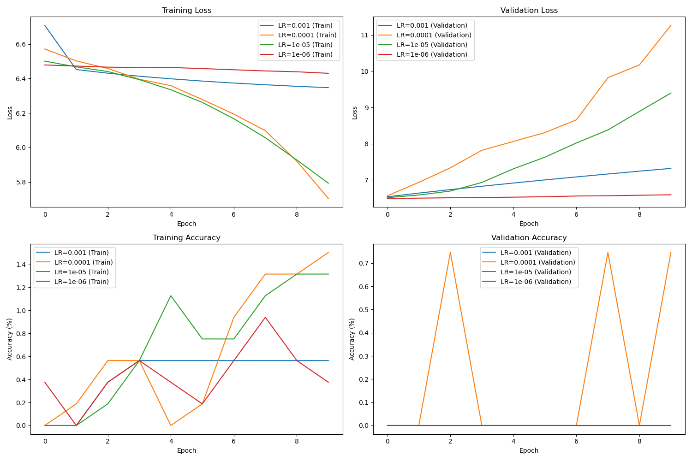
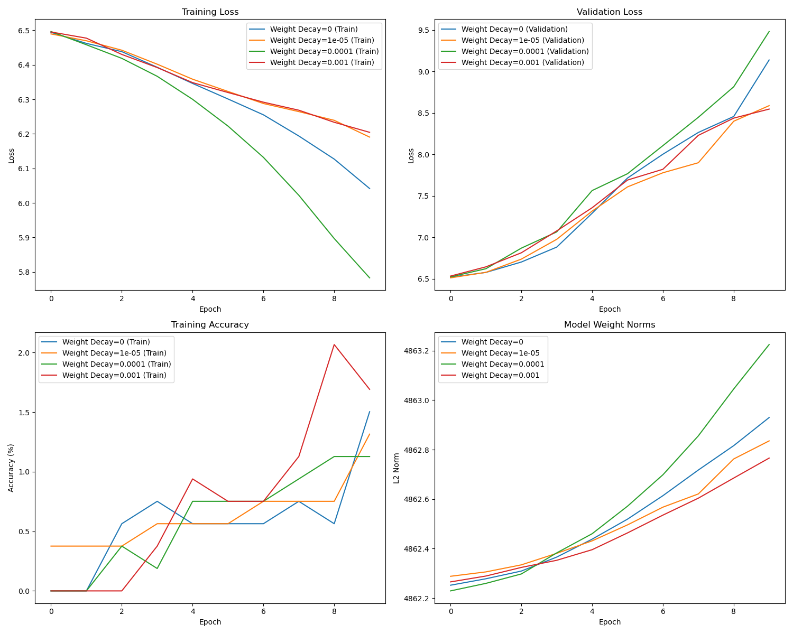
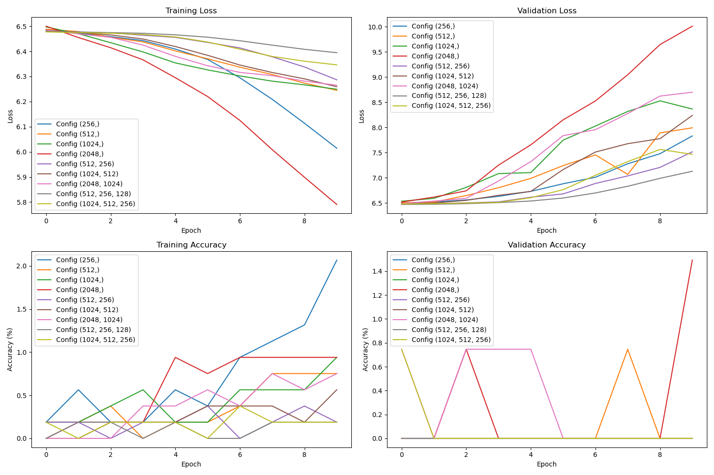

# Multimodal Classification Baseline
## 1. Overview

This repository implements a **simple multimodal classification baseline** that combines image and text representations using a **concatenation-based fusion** followed by an **MLP classifier**. This model does not rely on complex attention mechanisms or historical context, making it computationally efficient while still capturing meaningful interactions between the two modalities.

## 2. Dataset Description

The dataset consists of **scientific questions**, where each sample includes:
- **Question (Text Input)**: A question related to a given scientific figure or table.
- **Image (Visual Input)**: A corresponding figure or table extracted from the scientific paper.
- **Answer (Classification Label)**: The correct answer from predefined answer classes.

Each sample is structured as follows:
```
paper_id, Question, Answer, Image
```

Example:

```
1611.04684v1, "Which model performs best for response selection?", "KEHNN", "1611.04684v1-Table4-1.png"
```
The dataset is stored in **CSV format**, and images are organized in folders by their **paper_id**.

### **Data Preprocessing**
To process the dataset, we implemented a **custom PyTorch Dataset class (`MultimodalDataset`)**, which:
- Loads **images** from their respective directories and applies **ResNet preprocessing** (resize, normalize).
- Tokenizes **questions** using a **BERT tokenizer**.
- Converts **answers** into numerical class labels.

## 3. Model Architecture

### **Encoders**
- **ResNet-50**: A **frozen image encoder**, extracting a **512-dimensional feature vector** from the input image.
- **BERT-base**: Processes text input, using the `[CLS]` token embedding to generate a **512-dimensional vector**.

### **Fusion Strategy**
- The image and text feature vectors are **concatenated** directly, forming a **1024-dimensional representation**.

### **Classification**
- A simple **MLP classifier** with one hidden layer maps the fused representation to a probability distribution over answer choices.

## 4. Why This Baseline?

- **No Pretraining Required**: The model leverages **pretrained encoders** (ResNet and BERT), but the classifier itself is trained from scratch.
- **No Attention Mechanisms**: Unlike transformer-based multimodal approaches, this model does not rely on **cross-attention** or **self-attention** across modalities.
- **Computationally Efficient**: Since we directly concatenate embeddings without interaction layers, this model is faster to train and suitable for **low-resource environments**.

## 5. Expected Behavior

The results from the simple multimodal baseline indicate that the model struggles to learn meaningful representations for the classification task, as shown by the training logs:

```
Epoch [1/10], Train Loss: 6.4955, Train Acc: 0.00%, Val Loss: 6.5128, Val Acc: 0.00%
Epoch [2/10], Train Loss: 6.4668, Train Acc: 0.19%, Val Loss: 6.5918, Val Acc: 0.00%
Epoch [3/10], Train Loss: 6.4416, Train Acc: 0.00%, Val Loss: 6.6579, Val Acc: 0.00%
Epoch [4/10], Train Loss: 6.4005, Train Acc: 0.56%, Val Loss: 6.9174, Val Acc: 0.00%
Epoch [5/10], Train Loss: 6.3443, Train Acc: 0.56%, Val Loss: 7.2048, Val Acc: 0.00%
Epoch [6/10], Train Loss: 6.2713, Train Acc: 0.94%, Val Loss: 7.5994, Val Acc: 0.00%
Epoch [7/10], Train Loss: 6.1976, Train Acc: 1.32%, Val Loss: 7.9122, Val Acc: 0.00%
Epoch [8/10], Train Loss: 6.1015, Train Acc: 1.32%, Val Loss: 8.3691, Val Acc: 0.00%
Epoch [9/10], Train Loss: 5.9812, Train Acc: 1.69%, Val Loss: 8.6641, Val Acc: 0.00%
Epoch [10/10], Train Loss: 5.8547, Train Acc: 2.26%, Val Loss: 8.9270, Val Acc: 0.00%
```

### Analysis of Poor Performance

1. **Incompatible Model Design for QA Tasks:**
    The model is structured as a classification problem, but scientific question answering (QA) typically requires semantic understanding, retrieval, and reasoning rather than simple feature matching. By treating QA as a classification task with a fixed number of answer classes, the model lacks the flexibility to understand and generalize to new questions.

2. **Lack of Interaction Between Modalities:**
    The concatenation-based fusion of ResNet and BERT embeddings does not establish meaningful relationships between image and text.
Unlike attention-based multimodal models, this approach does not allow the model to dynamically focus on relevant parts of the image given a specific question.
As a result, the fused representation may not effectively capture cross-modal dependencies, leading to poor classification accuracy.
3. **Failure to Capture Contextual Information:**
    The model treats each question-image pair independently, without leveraging contextual relationships or reasoning chains.
In scientific QA, an answer often depends on interpreting figures, tables, and domain knowledge, which the model cannot infer through simple embedding concatenation.
4. **Increasing Validation Loss and No Generalization:**
    The steady increase in validation loss suggests that the model is memorizing training examples without actually learning meaningful generalizations.
The fact that validation accuracy remains at 0.00% indicates that the learned features are not transferable to unseen data.
### Conclusion
This baseline is insufficient for QA tasks because it relies solely on feature extraction and naive fusion without reasoning or retrieval mechanisms. While the concatenation approach works for some multimodal classification tasks (e.g., visual question answering with predefined answer sets), it is not well-suited for open-ended scientific question answering where understanding, context, and retrieval are crucial.

## 6. Metrics Verification
For simple multimoal, we conducted a systematic investigation into how our model's performance—particularly validation accuracy and loss—varies with key hyperparameters: learning rate, weight decay, and hidden dimensions. In the learning rate sweep, we explored values from 1e-3 to 1e-6 and found consistently low performance, with 1e-4 offering a slight improvement (0.75% validation accuracy), suggesting that the tested range may have been too conservative. For weight decay, we evaluated values from 0 to 1e-3 and observed negligible differences in accuracy or weight norms, with only 1e-3 yielding a minor uptick in validation accuracy. This indicated that regularization was not meaningfully impacting generalization. Lastly, in the hidden dimension sweep, we tested both shallow and deep MLP structures. Most configurations resulted in no validation accuracy, except for the single-layer model with 2048 units, which reached 1.49%. Deeper configurations performed worse, likely due to over-parameterization or optimization challenges.
<p align="center">
  
  
  
</p>
Overall, these results point to a deeper issue beyond hyperparameter tuning. The consistent underperformance suggests that the problem may lie in the frozen encoders, inadequate feature alignment, or the simplicity of the fusion mechanism. It is also possible that data quality, such as noisy labels or weak correlations between modalities, is limiting performance. Given that none of the tested configurations led to meaningful validation improvements, we conclude that architectural and data-level changes are necessary before further tuning can yield benefits.

### Intrinsic Metrics
Intrinsic metrics help us understand whether the model has the right "skills," even if it doesn’t succeed on the primary task. These experiments suggest that hyperparameter tuning alone is not sufficient. The consistently poor performance across settings points to deeper architectural limitations:
- **Frozen encoders prevent adaptation to the downstream task.**
- **Fusion strategy via naive concatenation may not align modalities effectively.**
- **Data issues (e.g., weak label correlation or noisy input) may limit learning.**

Thus, improvements at the data and architecture level may be more impactful than further tuning.

| Model Configuration                              | ROUGE   | Perplexity |
|--------------------------------------------------|---------|------------|
| Simple Multimodal (LR=1e-5, WD=1e-4, HD=256)      | 0.0253  | 13,955.07  |
| Simple Multimodal (LR=1e-4, WD=1e-3, HD=2048)     | 0.0523  | 2,203.05   |

### Qualitative Analysis and Examples
We performed a qualitative review of prediction examples to identify failure patterns. In each example, the model received a scientific question, an image (table or figure), and was expected to return an answer grounded in both modalities. However, the model produced the same irrelevant output in all cases, indicating a representational collapse.

❌ Example 1 -- Paper ID: 1811.02721v3

Question: How does the reliability of CoAP compare to TCPlp and what potential factors contribute to this difference?

True Answer: CoAP has slightly higher reliability (99.5%) than TCPlp (99.3%) due to retransmission, congestion control, and smaller packet sizes.

Prediction: The different stages of HUMBI body and cloth reconstruction are...

Confidence: 0.0020

❌ Example 2 -- Paper ID: 1703.07015v3

Question: Which model, VAR or LSTNet, is better at capturing both daily and weekly repeating patterns in the data?

True Answer: LSTNet

Prediction: The different stages of HUMBI body and cloth reconstruction are...

Confidence: 0.0020

❌ Example 3 -- Paper ID: 1705.09882v2

Question: Which part of the model is responsible for deciding which frames are most important for the re-identification task?

True Answer: Reinforced Temporal Attention (RTA) unit

Prediction: The different stages of HUMBI body and cloth reconstruction are...

Confidence: 0.0019

Despite variations in both the input questions and the types of visuals, the model generates the same response in all cases—an unrelated memorized answer.
### Theory on Failure
This consistent misprediction indicates a failure condition related to representational collapse or spurious memorization. Specifically:

- **Failure Condition: Static Encoder Collapse with Spurious Memorization**

Our model uses frozen encoders for image and text, preventing them from adapting to the classification task. If one encoder dominates or the embeddings are misaligned, the classifier may converge on a meaningless memorized output. Here, it appears the model latched onto an unrelated HUMBI reconstruction answer and repeats it regardless of input.

The extremely low confidence values (~0.0020) further support that the model is uncertain, stuck in a local minimum, and not benefiting from gradient updates. This results in irrelevant but internally reinforced predictions.